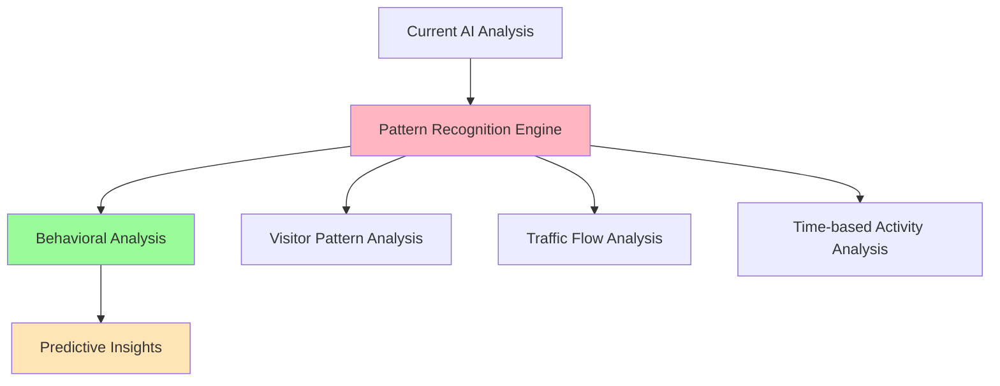
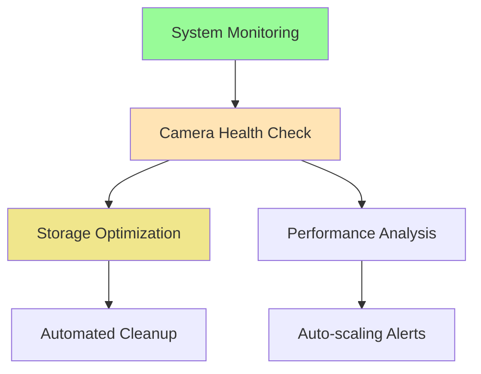

# 💡 Foscam Infrastructure Value-Add Ideas

*Generated ideas for expanding the current Foscam AI monitoring system*

## **🎯 High-Impact Value-Add Opportunities**

### **1. 🧠 Advanced Analytics & Intelligence**

#### **Pattern Recognition & Behavioral Analysis**


**Specific Ideas:**
- **Visitor Analytics**: Track regular vs. irregular visitors, delivery patterns, peak activity times
- **Anomaly Detection**: Identify unusual activities based on historical patterns
- **Predictive Alerts**: "Unusual activity detected - no movement in kitchen for 12+ hours"
- **Seasonal Analysis**: Different alert thresholds for different times of year

#### **Cross-Camera Intelligence**
- **Object Tracking**: Follow people/vehicles across multiple camera views
- **Zone-Based Analysis**: Define virtual zones and track movement patterns
- **Event Correlation**: Connect related events across different cameras

### **2. 🏠 Smart Home Integration**

#### **Automated Response System**
```python
# Example integration possibilities
class SmartHomeIntegration:
    def process_alert(self, alert_type, camera_location, confidence):
        if alert_type == "person_detected" and camera_location == "frontyard":
            self.turn_on_porch_light()
            self.send_notification_to_phone()
        elif alert_type == "motion_detected" and confidence > 0.9:
            self.activate_security_mode()
```

**Integration Opportunities:**
- **Home Assistant/OpenHAB**: Trigger lights, locks, alarms based on detections
- **Smart Lighting**: Auto-illuminate areas when motion detected
- **HVAC Integration**: Adjust temperature based on occupancy patterns
- **Security System**: Arm/disarm based on recognized vs. unknown individuals

### **3. 📱 Enhanced User Experience**

#### **Mobile App with Real-time Features**
- **Push Notifications**: Instant alerts with snapshot previews
- **Live Streaming**: View camera feeds directly in app
- **Two-way Audio**: Communicate through cameras (if supported)
- **Geofencing**: Different alert behavior when owners are home/away

#### **Advanced Search & Discovery**
- **Natural Language Search**: "Show me all deliveries last week"
- **Visual Search**: "Find similar activities to this image"
- **Timeline View**: Interactive timeline of all activities
- **Video Summarization**: AI-generated daily/weekly summaries

### **4. 🔄 Operational Intelligence**

#### **Proactive Maintenance**


**Specific Features:**
- **Camera Health Monitoring**: Detect offline cameras, poor image quality, lens obstructions
- **Storage Intelligence**: Automatically archive/delete old footage based on importance
- **Performance Optimization**: Dynamic GPU allocation, processing queue management
- **Predictive Maintenance**: Alert when cameras need cleaning or repositioning

### **5. 💼 Business Intelligence Features**

#### **Property & Security Analytics**
- **Foot Traffic Analysis**: Understand property usage patterns
- **Security Insights**: Identify vulnerable times/areas
- **Delivery Analytics**: Track package delivery patterns and timing
- **Weather Correlation**: How weather affects activity patterns

#### **Cost Optimization**
- **Energy Usage Analysis**: Correlate camera activity with energy consumption
- **Storage Cost Optimization**: Intelligent archiving based on content importance
- **Processing Efficiency**: Optimize AI model usage based on content type

## **🚀 Implementation Roadmap**

### **Phase 1: Quick Wins (1-2 weeks)**
1. **Enhanced Alerting**
   - Email/SMS notifications
   - Webhook integration for external systems
   - Alert customization by camera/time

2. **Basic Analytics Dashboard**
   - Daily/weekly activity summaries
   - Top alert types and locations
   - System health metrics

### **Phase 2: Advanced Features (1-2 months)**
1. **Pattern Recognition Engine**
   - Historical pattern analysis
   - Behavioral learning algorithms
   - Anomaly detection system

2. **Mobile App MVP**
   - Real-time notifications
   - Basic camera viewing
   - Alert management

### **Phase 3: Smart Integration (2-3 months)**
1. **Home Automation Integration**
   - MQTT/REST API for smart home systems
   - Automated response actions
   - Geofencing capabilities

2. **Advanced Analytics**
   - Cross-camera tracking
   - Predictive insights
   - Custom reporting

## **💡 Specific High-Value Features to Prioritize**

### **1. Person/Vehicle Recognition & Tracking**
- Build profiles of regular visitors
- Alert only for unknown individuals
- Track suspicious behavior patterns

### **2. Intelligent Storage Management**
- Keep important events longer
- Compress/archive routine footage
- Smart deletion based on content analysis

### **3. Weather-Aware System**
- Adjust sensitivity based on weather conditions
- Correlate activities with weather patterns
- Seasonal behavior adaptation

### **4. API-First Architecture**
- RESTful API for all functionality
- Webhook system for real-time integrations
- Third-party plugin architecture

## **🔧 Technical Implementation Ideas**

### **Enhanced AI Models**
- **Face Recognition**: Identify family members vs. strangers
- **Vehicle Recognition**: Track familiar vs. unknown vehicles
- **Gesture Recognition**: Detect waving, pointing, suspicious gestures
- **Audio Analysis**: Analyze sounds for breaking glass, shouting, etc.

### **Data Pipeline Enhancements**
- **Real-time Processing**: Stream processing for instant alerts
- **Edge Computing**: Process simple detections locally
- **Cloud Integration**: Backup and advanced processing in cloud
- **Multi-modal Analysis**: Combine video, audio, and sensor data

### **Integration Points**
- **MQTT Broker**: For IoT device communication
- **REST API**: For external system integration
- **WebSocket**: For real-time web interface updates
- **Webhook System**: For third-party notifications

## **📊 Potential Business Value**

### **Cost Savings**
- Reduce false alarms by 80%+ with better pattern recognition
- Optimize storage costs through intelligent archiving
- Predictive maintenance reduces camera downtime

### **Enhanced Security**
- Faster response times through automated alerts
- Better threat detection through behavioral analysis
- Comprehensive activity logging for investigations

### **Operational Efficiency**
- Automated routine monitoring tasks
- Intelligent prioritization of alerts
- Self-healing system components

### **User Experience**
- Intuitive mobile and web interfaces
- Personalized alert preferences
- Rich analytics and insights

---

*This document captures expansion opportunities for the Foscam infrastructure. Priority should be given to features that provide immediate value while building towards more advanced capabilities.* 